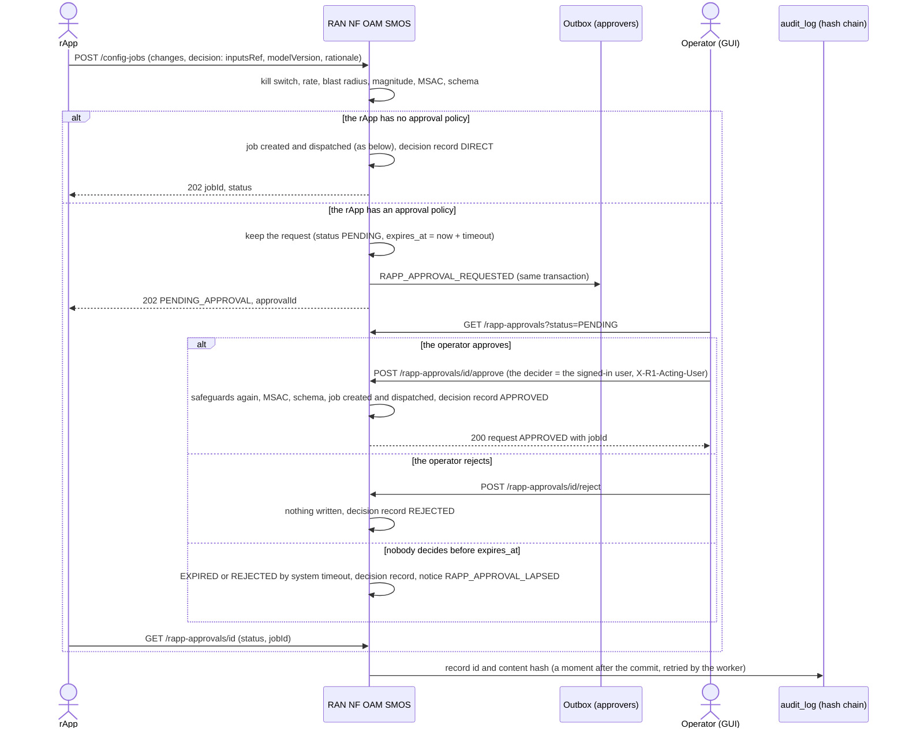
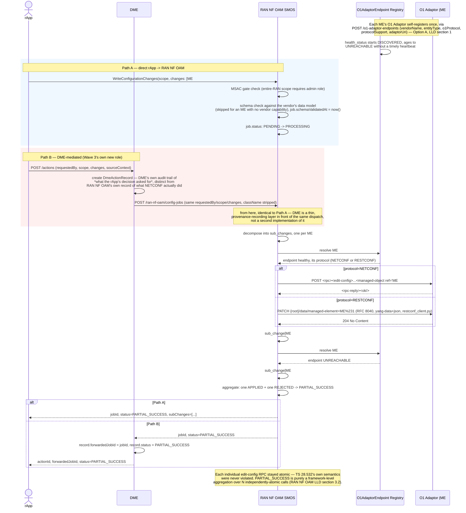

# Call Flow: Configuration Write, Fleet-Aware, Two Entry Paths

How a configuration change reaches real managed elements (RAN NF OAM LLD sections 1-5).
Under the Option A endpoint registry, RAN NF OAM is a fleet aggregator: it decomposes one
`WriteConfigurationChanges` call into one sub-change per managed element (ME), sends each
to that ME's O1 Adaptor, and aggregates the outcomes — which makes `PARTIAL_SUCCESS` real
without violating TS 28.532's all-or-nothing `PATCH` semantics. Dispatch follows the ME's
provisioned O1 protocol: an RFC 6241 `<edit-config>` XML RPC POSTed to the endpoint's
`adaptor_uri` (`netconf_client.py`), or an RFC 8040 RESTCONF request on the managed object's
data resource under that RESTCONF root (`restconf_client.py`).

There are two entry paths: an rApp calls RAN NF OAM directly (Path A), or calls DME's O1
action-mediation route `POST /dme/actions` (Path B), which records the decision's
provenance and forwards it to the same route (see "DME data path and action path" in
`docs/ARCHITECTURE.md`).

**Schema check.** Before any job is created, `POST /config-jobs` checks each change against
the vendor capability registry (`ran-nf-oam/app/vendors.py`, call flow 21):

- the ME's vendor must implement Provisioning, else 409 `O1_SERVICE_NOT_SUPPORTED`;
- its class, attributes and enum values must exist in the data model the vendor's
  conformance mode selects, else 422 `SCHEMA_VALIDATION_FAILED`, naming every offending attribute.

`cm_schema_cache` holds those data models. An ME with no vendor capability registered is
not schema-checked.

**Approval and the decision record.** An rApp whose instance has an approval policy (`ASSIST` mode, `approvalPolicy`, or set by an admin) gets `PENDING_APPROVAL` instead of a job: the write is kept after every check passed, the approvers are told, and a person approves it in the GUI (checks run again, then the dispatch below) or rejects it, or it lapses and writes nothing. Every job an rApp makes, approved or not, has a decision record (`decision` on the request: inputs reference, model version, rationale), hashed into the audit chain.

**Relation to call flows 02 and 09.** This flow is the CM-write mechanism itself,
regardless of who decided the change was needed. An rApp that has pulled a prediction via
DME (call flow 02) may act on it out of band through Path A or Path B; neither entry point
ties the call back to a specific inference job. An rApp instance whose onboarding-time
`autonomyMode` is `AUTONOMOUS`/`ASSIST` uses `RequestAutonomyDispatch` (call flow 09)
instead: the outcome is enacted as an `Intent`, and SA SMOS's generic O1-CM intent handler
then writes it through Path B with itself as the caller (call flows 09 and 22). Calling
Path A/B directly remains the manual route, and the only one for a `SHADOW` instance
(nothing is enforced) or an rApp acting on its own decision.

**Key decisions this flow depends on:**
- Under Option A, RAN NF OAM is a fleet aggregator over *N* per-ME O1 Adaptor instances, discovered via `POST /o1-adaptor-endpoints` self-registration — not a single-endpoint client. (Real MnS Registry NRM polling is a confirmed elision — this is the same lighter self-registration substitute DME's own producer registration and SME's own provider/invoker registration both use.)
- `PARTIAL_SUCCESS` exists in the schema but has no wire-level counterpart in TS 28.532 — it's realized entirely by decomposing one `WriteConfigurationChanges` call into independently-atomic per-ME `edit-config` RPCs and aggregating the outcomes.
- **Path B never duplicates Path A's dispatch logic.** DME's `/actions` route is deliberately a thin forward — one HTTP call to the same `POST /config-jobs` Path A's caller hits directly — so a dispatch-logic change (a new rejection reason, a new protocol) never needs touching in two places. A 4xx from RAN NF OAM (capability or schema refusal) is passed back unchanged and the action is recorded `REJECTED`.
- The client is chosen by the ME's `o1_protocol` (HISTORY.md OI-1-cm-sync-restconf). For RESTCONF the edit operation maps onto RFC 8040 methods: `merge` is PATCH, `replace` is PUT, `create` is POST on the parent, and `delete`/`remove` are DELETE. An ME provisioned for any other protocol is rejected with `PROTOCOL_NOT_SUPPORTED` on either path, with no silent fallback to "applied".
- Both protocols share one retry policy and one exhaustion alarm. A timeout or an unreachable agent is retried. A definite refusal (`<rpc-error>`, or an `ietf-restconf:errors` reply) is not retried.
- Alarm IDs raised anywhere in this flow are minted fresh (UUID) at ingestion, never trusting a raising ME's native ID directly — closing R1UCR's flagged fleet-wide collision risk.
